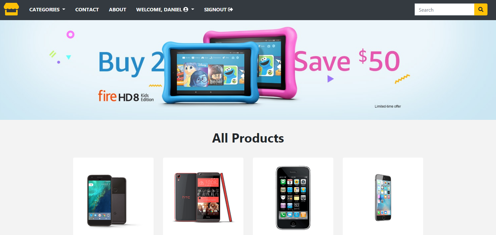
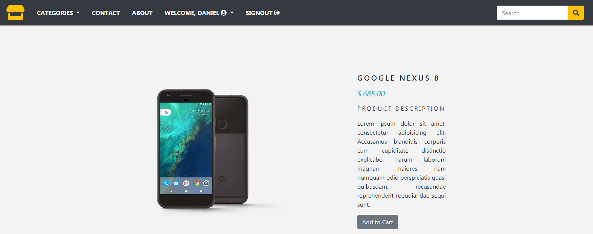
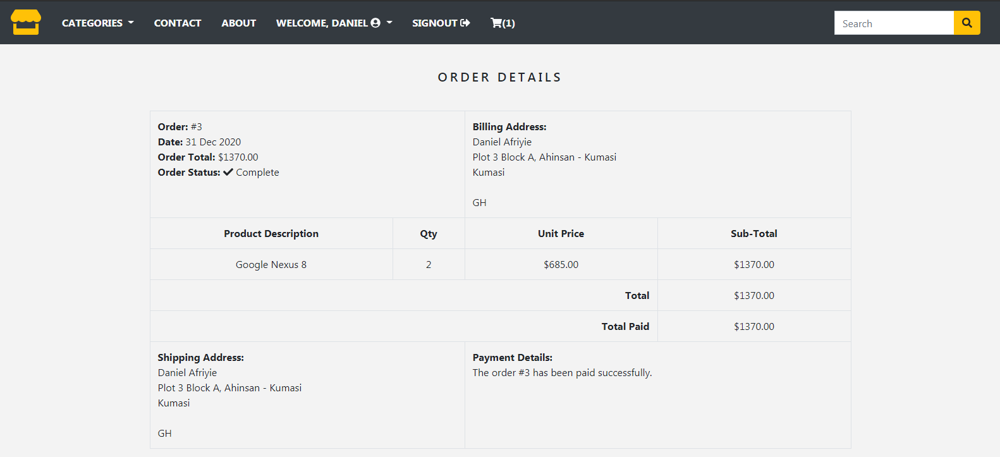

# DJANGO E-COMMERCE
Simple e-commerce store made with django.

   
   
   

## Installation
- Clone this repo. `git clone <repo-url>`
- Create a virtualenv. `python3 -m venv <name>`
- Activate it. `Linux/Mac source <name>/bin/activate, Windows call .\<name>\bin\activate`
- Install requirements. `pip install -r req.txt`
- Run `python manage.py runserver`

## Author

* **Afriyie Daniel**

Hope You Enjoy Using It !!!!